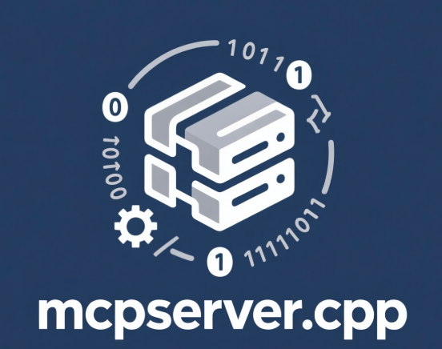

<div align="center">
  
  <h1>MCPserver++</h1>
  <p>A high-performance C++ implementation of the Model Communication Protocol server</p>

[](https://en.cppreference.com/w/cpp/20)
[](LICENSE)
[](https://github.com/caomengxuan666/MCPServer++/actions)
</div>

## Language Versions

- [English (Default)](README.md)
- [中文版](README_zh.md)

## Table of Contents

- [Introduction](#introduction)
- [Features](#features)
- [Architecture](#architecture)
- [Getting Started](#getting-started)
- [Building from Source](#building-from-source)
- [Configuration](#configuration)
- [Plugins](#plugins)
- [API Reference](#api-reference)
- [Contributing](#contributing)
- [License](#license)

## Introduction

MCPserver++ is a high-performance, cross-platform server implementation of the Model Communication Protocol (MCP) written in modern C++. It enables seamless communication between AI models and external tools, providing a standardized interface for extending model capabilities.

The server implements the JSON-RPC 2.0 protocol over HTTP transport and supports both regular request-response and Server-Sent Events (SSE) streaming for real-time communication.

## Features

- 🚀 **High Performance**: Built with C++20 and optimized with mimalloc for superior performance
- 🔌 **Plugin System**: Extensible architecture with dynamic plugin loading
- 🌐 **HTTP Transport**: Full HTTP/1.1 support with SSE streaming capabilities
- 📦 **JSON-RPC 2.0**: Complete implementation of the JSON-RPC 2.0 specification
- 🛠️ **Built-in Tools**: Includes file operations, HTTP requests, and system commands
- 🧠 **AI Model Ready**: Designed specifically for AI model integration
- 🔄 **Asynchronous I/O**: Powered by ASIO for efficient concurrent handling
- 📊 **Logging**: Comprehensive logging with spdlog
- 📈 **Scalable**: Multi-threaded architecture for handling concurrent requests
- 🌍 **Cross-platform**: Works on Windows, Linux, and macOS

## Architecture

MCPserver++ follows a modular architecture with clearly separated components:

```
┌─────────────────────────────────────────────────────────────┐
│                      MCPserver++                            │
├─────────────────────────────────────────────────────────────┤
│                   Transport Layer                           │
│  ┌─────────────┐  ┌─────────────┐  ┌─────────────────────┐  │
│  │ HTTP Server │  │  Stdio I/O  │  │   Other Protocols   │  │
│  └─────────────┘  └─────────────┘  └─────────────────────┘  │
├─────────────────────────────────────────────────────────────┤
│                    Protocol Layer                           │
│              ┌──────────────────────┐                       │
│              │    JSON-RPC 2.0      │                       │
│              └──────────────────────┘                       │
├─────────────────────────────────────────────────────────────┤
│                   Business Logic Layer                      │
│  ┌─────────────┐  ┌─────────────┐  ┌─────────────────────┐  │
│  │ Tool Reg.   │  │  Plugins    │  │ Request Processing  │  │
│  └─────────────┘  └─────────────┘  └─────────────────────┘  │
├─────────────────────────────────────────────────────────────┤
│                      Core Services                          │
│  ┌─────────────┐  ┌─────────────┐  ┌─────────────────────┐  │
│  │   Logger    │  │   Memory    │  │  Object Pooling     │  │
│  └─────────────┘  └─────────────┘  └─────────────────────┘  │
└─────────────────────────────────────────────────────────────┘
```

### Core Components

1. **Transport Layer**: Handles communication over various protocols (HTTP, stdio, etc.)
2. **Protocol Layer**: Implements JSON-RPC 2.0 message parsing and formatting
3. **Business Logic Layer**: Manages tools, plugins, and request processing
4. **Core Services**: Provides essential services like logging, memory management, and object pooling

## Getting Started

### Prerequisites

- C++20 compatible compiler (MSVC, GCC 10+, Clang 12+)
- CMake 3.23 or higher
- Git

### Quick Start

1. Clone the repository:
   ```bash
   git clone https://github.com/caomengxuan666/MCPServer++.git
   cd MCPServer++
   ```

2. Build the project:
   ```bash
   mkdir build
   cd build
   cmake ..
   cmake --build .
   ```

3. Run the server:
   ```bash
   ./bin/mcp-server++
   ```

The server will start on the default port and load the built-in plugins.

## Building from Source

### Windows

```bash
mkdir build
cd build
cmake ..
cmake --build . --config Release
```

### Linux/macOS

```bash
mkdir build
cd build
cmake ..
make -j$(nproc)
```

### Build Options

| Option | Description | Default |
|--------|-------------|---------|
| `BUILD_TESTS` | Build unit tests | ON |
| `CMAKE_BUILD_TYPE` | Build type (Debug, Release, etc.) | Release |

## Configuration

The server can be configured through the [main.cpp](src/main.cpp) file. Key configuration options include:

- Plugin loading
- Built-in tool registration
- Transport settings

Example configuration:
```cpp
auto server = mcp::core::MCPserver::Builder{}
                      .with_builtin_tools()
                      .with_plugin("file_plugin.dll")
                      .with_plugin("http_plugin.dll")
                      .build();
```

## Plugins

MCPserver++ supports a powerful plugin system that allows extending functionality without modifying the core server. Plugins are dynamic libraries that implement the MCP plugin interface.

### Official Plugins

- `file_plugin`: File system operations
- `http_plugin`: HTTP client functionality
- `safe_system_plugin`: Secure system command execution
- `example_stream_plugin`: Streaming data example

### Plugin Development

See [plugins/README.md](plugins/README.md) for detailed information on developing custom plugins.

## API Reference

The server implements the JSON-RPC 2.0 protocol over HTTP. All requests should be sent to the `/mcp` endpoint.

### Example Request

```json
{
  "jsonrpc": "2.0",
  "id": 1,
  "method": "tools",
  "params": {}
}
```

### Example Response

```json
{
  "jsonrpc": "2.0",
  "id": 1,
  "result": [
    {
      "name": "read_file",
      "description": "Read a file",
      "inputSchema": {
        "type": "object",
        "properties": {
          "path": {
            "type": "string",
            "description": "Path to the file to read"
          }
        },
        "required": ["path"]
      }
    }
  ]
}
```

## Contributing

We welcome contributions from the community! Please see [CONTRIBUTING.md](CONTRIBUTING.md) for guidelines on how to contribute to this project.

### Development Setup

1. Fork the repository
2. Create a feature branch
3. Make your changes
4. Add tests if applicable
5. Submit a pull request

## License

This project is licensed under the MIT License - see the [LICENSE](LICENSE) file for details.

---

<div align="center">
  <p>Built with ❤️ for the AI community</p>
  <p><a href="https://github.com/caomengxuan666/MCPserver++">GitHub</a> | <a href="https://caomengxuan666/MCPserver++">Documentation</a> | <a href="https://github.com/caoe/MCPServer++/issues">Issues</a></p>
</div>