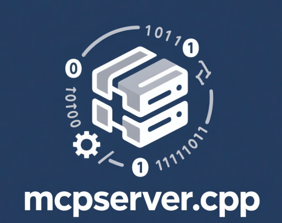

<div align="center">
  
  <h1>MCPServer.cpp</h1>
  <p>高性能的 C++ 实现模型通信协议服务器</p>

[](https://en.cppreference.com/w/cpp/20)
[](LICENSE)
[](https://github.com/caomengxuan666/MCPServer.cpp/actions)
</div>

## 语言版本

- [English (默认)](README.md)
- [中文版](README_zh.md)

## 目录

- [简介](#简介)
- [功能特性](#功能特性)
- [架构](#架构)
- [快速开始](#快速开始)
- [从源码构建](#从源码构建)
- [配置](#配置)
- [认证](#认证)
- [插件](#插件)
- [API 参考](#api-参考)
- [CI/CD 流水线](#cicd-流水线)
- [贡献](#贡献)
- [许可证](#许可证)

## 简介

MCPServer.cpp 是一个使用现代 C++ 编写的高性能、跨平台的模型通信协议（MCP）服务器实现。它能够实现 AI 模型与外部工具之间的无缝通信，为扩展模型功能提供标准化接口。

该服务器通过 HTTP 传输实现了 JSON-RPC 2.0 协议，并支持常规请求-响应和服务器发送事件（SSE）流式传输，以实现实时通信。

## 功能特性

### MCP 原语支持矩阵

| 原语 | 状态 | 说明 |
|-----------|--------|-------|
| Tools | ✅ 完全支持 | 在隔离的插件环境中执行工具 |
| Prompts | ✅ 基础支持 | 提示词模板和管理 |
| Resources | ✅ 基础支持 | 向LLM暴露数据和内容 |
| Sampling | 🚧 计划中 | 基于LLM的采样操作 |
| Roots | 🚧 计划中 | 文件系统访问控制 |

### 核心功能

- 完整实现模型通信协议（MCP）
- 基于 HTTP/HTTPS 的 JSON-RPC 2.0 传输协议
- 插件系统，可扩展功能
- 内置工具（echo、文件操作、HTTP请求、系统命令）
- 使用服务器发送事件（SSE）的流式响应
- 全面的日志记录和错误处理
- 🚀 **高性能**：基于 C++20 构建，并使用 mimalloc 进行性能优化
- 🔌 **插件系统**：可扩展的架构，支持动态插件加载
- 🌐 **HTTP 传输**：完整的 HTTP/1.1 支持，具备 SSE 流功能
- 📦 **JSON-RPC 2.0**：完整实现 JSON-RPC 2.0 规范
- 🛠️ **内置工具**：包括文件操作、HTTP 请求和系统命令
- 🧠 **AI 模型就绪**：专为 AI 模型集成而设计
- 🔄 **异步 I/O**：基于 ASIO 实现高效的并发处理
- 📊 **日志记录**：使用 spdlog 实现全面的日志记录
- 📈 **可扩展性**：多线程架构，可处理并发请求
- 🌍 **跨平台**：支持 Windows、Linux 和 macOS
- 📁 **资源管理**：通过 Resources 原语向 LLM 暴露数据和内容

## 架构

MCPServer.cpp 采用模块化架构，各组件之间界限清晰：

```
┌─────────────────────────────────────────────────────────────┐
│                      MCPServer.cpp                            │
├─────────────────────────────────────────────────────────────┤
│                    传输层 (Transport Layer)                  │
│  ┌─────────────┐  ┌─────────────┐  ┌─────────────────────┐  │
│  │ HTTP 服务器 │  │  标准I/O    │  │   其他协议          │  │
│  └─────────────┘  └─────────────┘  └─────────────────────┘  │
├─────────────────────────────────────────────────────────────┤
│                    协议层 (Protocol Layer)                   │
│              ┌──────────────────────┐                       │
│              │    JSON-RPC 2.0      │                       │
│              └──────────────────────┘                       │
├─────────────────────────────────────────────────────────────┤
│                  业务逻辑层 (Business Logic Layer)           │
│  ┌─────────────┐  ┌─────────────┐  ┌─────────────────────┐  │
│  │ 工具注册表  │  │   插件      │  │  请求处理           │  │
│  └─────────────┘  └─────────────┘  └─────────────────────┘  │
├─────────────────────────────────────────────────────────────┤
│                      核心服务 (Core Services)               │
│  ┌─────────────┐  ┌─────────────┐  ┌─────────────────────┐  │
│  │   日志系统  │  │   资源      │  │    配置            │  │
│  └─────────────┘  └─────────────┘  └─────────────────────┘  │
└─────────────────────────────────────────────────────────────┘
```

### 核心组件

1. **传输层**: 处理各种协议的通信（HTTP、stdio 等）
2. **协议层**: 实现 JSON-RPC 2.0 消息解析和格式化
3. **业务逻辑层**: 管理工具、插件和请求处理
4. **核心服务**: 提供日志、资源和配置等基本服务

## 快速开始

### 环境要求

- C++20 兼容编译器 (MSVC, GCC 10+, Clang 12+)
- CMake 3.23 或更高版本
- Git

### 快速开始指南

1. 克隆仓库：
   ```bash
   git clone https://github.com/caomengxuan666/MCPServer.cpp.git
   cd MCPServer.cpp
   ```

2. 构建项目：
   ```bash
   mkdir build
   cd build
   cmake ..
   cmake --build .
   ```

3. 运行服务器：
   ```bash
   ./bin/mcp-server++
   ```

服务器将在默认端口启动并加载内置插件。

## 从源码构建

### Windows

```bash
mkdir build
cd build
cmake ..
cmake --build . --config Release
```

### Linux/macOS

```bash
mkdir build
cd build
cmake ..
make -j$(nproc)
```

### 构建选项

| 选项 | 描述 | 默认值 |
|------|------|--------|
| `BUILD_TESTS` | 构建单元测试 | ON |
| `CMAKE_BUILD_TYPE` | 构建类型 (Debug, Release, 等) | Release |

## 配置

有关如何配置服务器的详细信息，请参见[配置](#配置)部分。

## 认证

MCPServer++ 支持认证机制，以保护您的服务器免受未授权访问。有关如何配置和使用认证的详细信息，请参见 [AUTH_zh.md](docs/AUTH_zh.md)。

## 插件

MCPServer.cpp 支持强大的插件系统，允许在不修改核心服务器的情况下扩展功能。插件是实现 MCP 插件接口的动态库。

### 官方插件

- `file_plugin`: 文件系统操作
- `http_plugin`: HTTP 客户端功能
- `safe_system_plugin`: 安全系统命令执行
- `example_stream_plugin`: 流式数据示例

### Python 插件

MCPServer++ 现在通过新的 Python SDK 支持 Python 插件，这使得插件开发更加直观。Python 插件被编译为动态库 (DLL/SO)，使用 pybind11 包装 Python 代码。

#### 创建 Python 插件

要创建新的 Python 插件，请使用 [plugin_ctl](file:///D:/codespace/MCPServer++/tools/plugin_ctl.cpp#L759-L759) 工具：

```bash
./plugin_ctl create -p my_python_plugin
```

这将生成一个使用新的 Python SDK 的 Python 插件模板，其中包含装饰器和辅助函数。

#### Python 插件特性

- 基于装饰器的工具定义，使用 [@tool](file://d:\codespace\MCPServer++\plugins\sdk\mcp_sdk.py#L173-L186)
- 自动 JSON 处理
- 流式工具支持
- 参数验证辅助函数
- 与 MCP 协议的轻松集成

有关 Python 插件开发的详细信息，请参阅 [Python 插件文档](docs/PYTHON_PLUGINS_zh.md)。

### 插件开发

有关开发自定义插件的详细信息，请参阅 [plugins/README_zh.md](plugins/README_zh.md)。

## API 参考

服务器通过 HTTP 实现了 JSON-RPC 2.0 协议。所有请求应发送到 `/mcp` 端点。

### 请求示例

```json
{
  "jsonrpc": "2.0",
  "id": 1,
  "method": "tools",
  "params": {}
}
```

### 响应示例

```json
{
  "jsonrpc": "2.0",
  "id": 1,
  "result": [
    {
      "name": "read_file",
      "description": "读取文件",
      "inputSchema": {
        "type": "object",
        "properties": {
          "path": {
            "type": "string",
            "description": "要读取的文件路径"
          }
        },
        "required": ["path"]
      }
    }
  ]
}
```

## Docker 部署

### 构建与运行
1. **使用多阶段构建**（镜像体积优化至10-15MB）
   ```bash
   docker build -t mcp-server .
   docker run -p 6666:6666 -v $(pwd)/plugins:/plugins -v $(pwd)/certs:/certs mcp-server
   ```

2. **HTTPS 配置**（需挂载证书目录）
   ```bash
   # 启用HTTPS需在config.ini设置 enable_https=1
   # 证书文件需放置在容器内/certs目录
   docker run -p 6667:6667 -v $(pwd)/certs:/certs mcp-server
   ```

### 插件系统
- **插件路径映射**：容器内插件目录为`/plugins`，建议通过volume映射本地插件目录
- **插件加载**：支持运行时热加载插件（需确保插件文件权限正确）

### 镜像优化
- 基于 `gcr.io/distroless/cc-debian12` 最小基础镜像
- 启用静态链接+剥离调试信息（LTO优化）
- 国内用户可配置镜像加速器（见文档底部配置示例）

## Docker Hub

预构建的 Docker 镜像可在 Docker Hub 获取：[https://hub.docker.com/r/mgzy/mcp-server](https://hub.docker.com/r/mgzy/mcp-server)

您可以直接拉取并运行最新镜像：
```bash
docker pull mgzy/mcp-server
docker run -p 6666:6666 -v $(pwd)/plugins:/plugins -v $(pwd)/certs:/certs mgzy/mcp-server
```

## CI/CD 流水线

我们的项目使用 GitHub Actions 进行持续集成和部署。流水线会自动在多个平台上构建和测试服务器：

### 支持的平台

- **Ubuntu 22.04** (GitHub Actions 最新 LTS)
- **Ubuntu 24.04** (GitHub Actions 最新 Ubuntu 版本)
- **Windows Server 2022** (GitHub Actions 最新 Windows)

### 构建变体

我们提供两种构建变体以满足不同需求：
1. **完整构建**: 包含所有库和开发头文件
2. **最小构建**: 仅包含可执行文件和必要文件（无开发头文件或库）

### 打包格式

CI/CD 流水线生成多种格式的包：
- **Windows**: ZIP, NSIS 安装程序 (EXE)
- **Linux**: DEB, RPM, TAR.GZ, ZIP

## 贡献

我们欢迎社区的贡献！请查看 [CONTRIBUTING.md](CONTRIBUTING.md) 了解如何为该项目做出贡献的指南。

### 开发设置

1. Fork 仓库
2. 创建功能分支
3. 进行修改
4. 如适用，添加测试
5. 提交拉取请求

## 许可证

该项目基于 MIT 许可证 - 详情请见 [LICENSE](LICENSE) 文件。

---

<div align="center">
  <p>为 AI 社区 ❤️ 而构建</p>
  <p><a href="https://github.com/caomengxuan666/MCPServer.cpp">GitHub</a> | <a href="https://github.com/caomengxuan666/MCPServer.cpp/issues">问题</a></p>
</div>